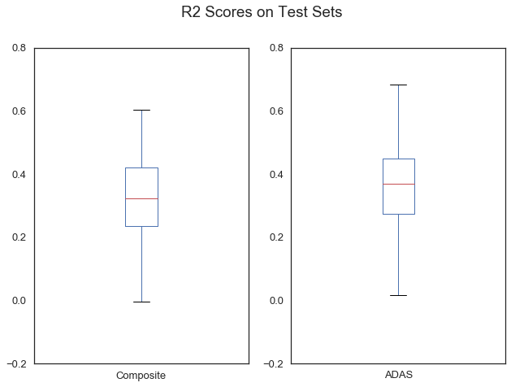
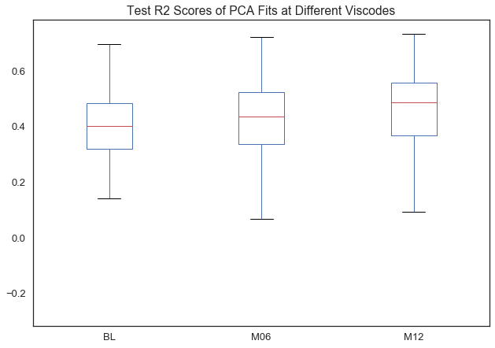
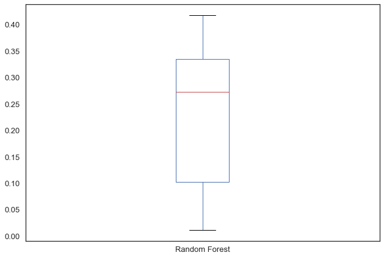
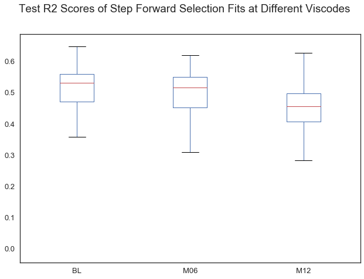
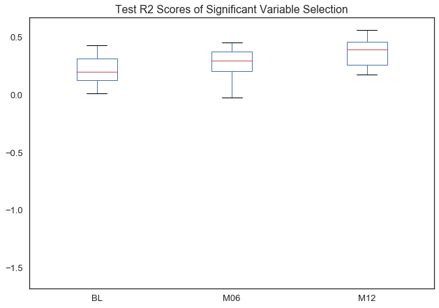

## Contents
{:.no_toc}
*  
{: toc}

##  Baseline Model

We began with an OLS linear regression fit to the composite scores from each test. Improvements to this baseline would indicate that question-level information from the tests provides useful information. 

A second baseline model used scores from the individual questions of the ADAS exam. Improvements on this model would indicate that questions from other tests capture useful information that the ADAS items did not.

Both of these models had high variance. The table and boxplots below show the R2 scores on test sets for the Composite Score model and ADAS Question models over 100 iterations (each trained on 80% of the data from the baseline visit records). We decided to measure our models against the mean R2 score of these 100 iterations of these models, which were:

**Composite Model**: 0.310262

**ADAS Questions**: 0.347127

<table border="0" class="dataframe" align="center" >
  <thead>
    <tr style="text-align: right;">
      <th></th>
      <th>Composite</th>
      <th>ADAS</th>
    </tr>
  </thead>
  <tbody>
    <tr>
      <th>count</th>
      <td>100.000000</td>
      <td>100.000000</td>
    </tr>
    <tr>
      <th>mean</th>
      <td>0.310262</td>
      <td>0.347127</td>
    </tr>
    <tr>
      <th>std</th>
      <td>0.159539</td>
      <td>0.158335</td>
    </tr>
    <tr>
      <th>min</th>
      <td>-0.237299</td>
      <td>-0.084577</td>
    </tr>
    <tr>
      <th>25%</th>
      <td>0.234332</td>
      <td>0.274454</td>
    </tr>
    <tr>
      <th>50%</th>
      <td>0.322030</td>
      <td>0.369095</td>
    </tr>
    <tr>
      <th>75%</th>
      <td>0.420380</td>
      <td>0.448626</td>
    </tr>
    <tr>
      <th>max</th>
      <td>0.604135</td>
      <td>0.682914</td>
    </tr>
  </tbody>
</table>

## Attempts to Improve the Model

Given that the cognitive exam data provides more items than ADNI has subjects, variable selection was the central challenge in our attempts to improve upon the baseline model. Adding questions from other tests added new information that we expected to increase the predictive abilities of our models. However, adding many new predictors increased the risk of overfitting.

We implemented four approaches: PCA, Random Forest, Step Forward Variable Selection, and picking the most significant predictors from linear regressions fit to each cognitive test separately. Here, we provide short descriptions of our methods, followed by boxplots of R2 scores on the test set over 100, 20, or 5 iterations for each model.

**Attempt 1: PCA**  We implemented Principal Component Analysis on the complete set of questions from every cognitive test and then fit an OLS linear regression on the resulting components. The number of components used in the final model of this attempt was chosen via cross-validation. 

**Attempt 2: Random Forest** We implemented a Random Forest Regressor on the set of questions on every cognitive test combined. We used GridSearchCV to determine the best number of trees and best number of features when making the splits.

**Attempt 3: Step Forward Variable Selection** We used a classic step-forward variable selection approach, fitting linear regression models and using the Bayes Information Criterion as the metric to determine whether or not adding a feature improved the model. 

**Attempt 4: Picking the Most Significant Predictors from Linear Regressions Fit on Items from Individual Cognitive Tests** 
We fit linear regression models to the individual question predictors from each cognitive test separately (i.e. we fit one model to the ADAS questions, another model to the NPI questions, etc.). We then extracted the most significant predictors from each fit. 

To determine the most significant predictors, we selected those with a p-value of less than 0.03 from each fit iteration (we decided to use an extra-stringent p-value because it decreased the risk of overfitting). We ran 100 iterations of this process on different subsets of the training data, and then selected out the predictors that were considered significant in at least 50% of the trials.

After obtaining the most significant predictors from each cognitive test separately, we combined these sets to run another Linear Regression fit, regularized using RidgeCV.

## Modeling Results

### Attempt 1: PCA

These results are aggregated from 100 iterations of the fitting and scoring process.

<table border="0" class="dataframe">
  <thead>
    <tr style="text-align: right;">
      <th></th>
      <th>BL</th>
      <th>M06</th>
      <th>M12</th>
    </tr>
  </thead>
  <tbody>
    <tr>
      <th>count</th>
      <td>100.000000</td>
      <td>100.000000</td>
      <td>100.000000</td>
    </tr>
    <tr>
      <th>mean</th>
      <td>0.394858</td>
      <td>0.416983</td>
      <td>0.452928</td>
    </tr>
    <tr>
      <th>std</th>
      <td>0.141369</td>
      <td>0.148913</td>
      <td>0.156662</td>
    </tr>
    <tr>
      <th>min</th>
      <td>-0.067906</td>
      <td>-0.141462</td>
      <td>-0.266538</td>
    </tr>
    <tr>
      <th>25%</th>
      <td>0.319827</td>
      <td>0.337235</td>
      <td>0.368354</td>
    </tr>
    <tr>
      <th>50%</th>
      <td>0.401427</td>
      <td>0.436067</td>
      <td>0.487651</td>
    </tr>
    <tr>
      <th>75%</th>
      <td>0.484006</td>
      <td>0.522451</td>
      <td>0.558202</td>
    </tr>
    <tr>
      <th>max</th>
      <td>0.696542</td>
      <td>0.723071</td>
      <td>0.734190</td>
    </tr>
  </tbody>
</table>

We fit models separately for data from the baseline of the study, six months after baseline, and twelve months after baseline.

## Attempt 2: Random Forest

Because of computation time, these results are aggregated from 5 iterations of fitting on the baseline set only.

<table border="0" class="dataframe">
  <thead>
    <tr style="text-align: right;">
      <th></th>
      <th>Random Forest</th>
    </tr>
  </thead>
  <tbody>
    <tr>
      <th>count</th>
      <td>5.000000</td>
    </tr>
    <tr>
      <th>mean</th>
      <td>0.228166</td>
    </tr>
    <tr>
      <th>std</th>
      <td>0.167640</td>
    </tr>
    <tr>
      <th>min</th>
      <td>0.011703</td>
    </tr>
    <tr>
      <th>25%</th>
      <td>0.102406</td>
    </tr>
    <tr>
      <th>50%</th>
      <td>0.272684</td>
    </tr>
    <tr>
      <th>75%</th>
      <td>0.335513</td>
    </tr>
    <tr>
      <th>max</th>
      <td>0.418522</td>
    </tr>
  </tbody>
</table>

## Attempt 3: Step Forward Variable Selection

These results are aggregated from 100 iterations of the fitting and scoring process.

<table border="0" class="dataframe">
  <thead>
    <tr style="text-align: right;">
      <th></th>
      <th>BL</th>
      <th>M06</th>
      <th>M12</th>
    </tr>
  </thead>
  <tbody>
    <tr>
      <th>count</th>
      <td>100.000000</td>
      <td>100.000000</td>
      <td>100.000000</td>
    </tr>
    <tr>
      <th>mean</th>
      <td>0.504240</td>
      <td>0.500132</td>
      <td>0.455448</td>
    </tr>
    <tr>
      <th>std</th>
      <td>0.100873</td>
      <td>0.067209</td>
      <td>0.064618</td>
    </tr>
    <tr>
      <th>min</th>
      <td>-0.011152</td>
      <td>0.295320</td>
      <td>0.283050</td>
    </tr>
    <tr>
      <th>25%</th>
      <td>0.469798</td>
      <td>0.451819</td>
      <td>0.406670</td>
    </tr>
    <tr>
      <th>50%</th>
      <td>0.530823</td>
      <td>0.515902</td>
      <td>0.454912</td>
    </tr>
    <tr>
      <th>75%</th>
      <td>0.559100</td>
      <td>0.549381</td>
      <td>0.497350</td>
    </tr>
    <tr>
      <th>max</th>
      <td>0.648026</td>
      <td>0.618086</td>
      <td>0.653340</td>
    </tr>
  </tbody>
</table>

## Attempt 4: "Most Significant Predictors"

Because of computation time, these results are aggregated from 20 iterations of the fitting process.

<table border="0" class="dataframe">
  <thead>
    <tr style="text-align: right;">
      <th></th>
      <th>BL</th>
      <th>M06</th>
      <th>M12</th>
    </tr>
  </thead>
  <tbody>
    <tr>
      <th>count</th>
      <td>20.000000</td>
      <td>20.000000</td>
      <td>20.000000</td>
    </tr>
    <tr>
      <th>mean</th>
      <td>0.109899</td>
      <td>0.280431</td>
      <td>0.350597</td>
    </tr>
    <tr>
      <th>std</th>
      <td>0.434544</td>
      <td>0.114269</td>
      <td>0.161848</td>
    </tr>
    <tr>
      <th>min</th>
      <td>-1.569883</td>
      <td>-0.022739</td>
      <td>-0.158760</td>
    </tr>
    <tr>
      <th>25%</th>
      <td>0.126259</td>
      <td>0.207914</td>
      <td>0.259547</td>
    </tr>
    <tr>
      <th>50%</th>
      <td>0.199571</td>
      <td>0.296495</td>
      <td>0.396256</td>
    </tr>
    <tr>
      <th>75%</th>
      <td>0.316555</td>
      <td>0.373224</td>
      <td>0.459338</td>
    </tr>
    <tr>
      <th>max</th>
      <td>0.427487</td>
      <td>0.453058</td>
      <td>0.564867</td>
    </tr>
  </tbody>
</table>

