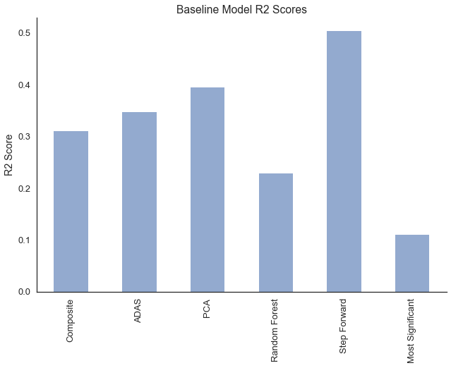
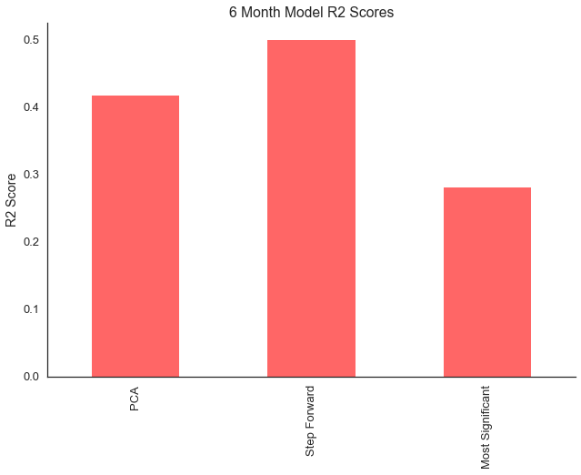
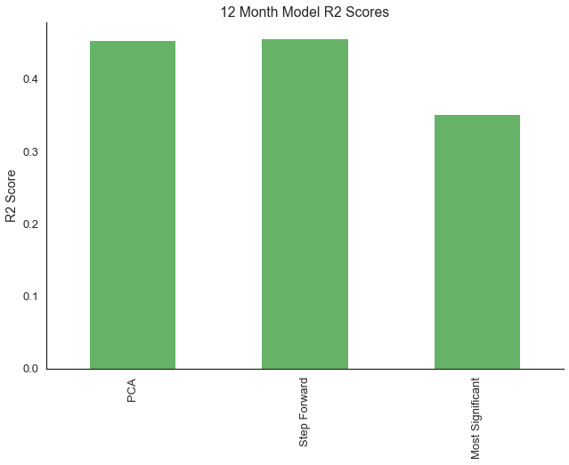
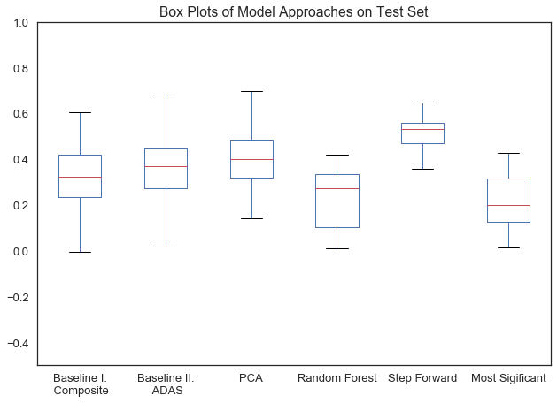

## Contents
{:.no_toc}
*  
{: toc}

### Step Forward Variable Selection Was the Best Model 

We succeeded in improving upon our baseline models' abilities to predict HCI with both the PCA and the Step Forward modeling approaches.

The Step Forward Variable Selection model turned out to do the best job of predicting HCI on the baseline and 6 month datasets, while PCA and Step Forward had roughly equal predictive abilities on the 12 month dataset (see bar plots below). Step Forward improved the R2 score of the best baseline (ADAS) by about 0.15. 
The Random Forest and Most Significant Predictor models had worse predictive abilities than both baseline models.

Many of our models had high variance (see the box plot comparison below). The Step Forward model had the least variance in test R2 scores of all models that we tested. 

Because of the high R2 scores and relatively low variance that we observed, we conclude that Step Forward was the best approach for predicting HCI from cognitive test score answers. 

### Result Visualization

**R2 Score Comparisons** In the following three bar plots, we noted that Step Forward and PCA has higher mean test R2 scores on the baseline dataset. We also observed differences that the results of the PCA fit became increasingly similar to those of the Step Forward as time progressed from the baseline visit to 6 months and then to 12 months.

** Variance Comparisons **  In the following box plot graph, we observed a much smaller tail spread on the Step Forward box compared to the other models. This indicated lower variance in results, suggesting a more reliable predictive ability.

### Analysis of Predictors Selected

According to the one trial of the Step Forward variable selection model, the significant predictors were:

**Baseline Visit:**
- 'word_recall_0',
- 'number_cancellation_0',
- 'hmstepws',
- 'gdhappy_sc',
- 'cdorient_sc',
- 'faqtv_bl',
- 'faqshop_bl'

**6 Months**
- 'word_recall_06',
- 'number_cancellation_06',
- 'cdorient_06',
- 'mmfold_06',
- 'mmrepeat_06',
- 'construction_06',
- 'faqsource_06',
- 'npif_06',
- 'mmdraw_06'

**12 Months**

- 'word_recall_12',
- 'faqfinan_12',
- 'gdenergy_12',
- 'number_cancellation_12',
- 'cdorient_12',
- 'cdjudge_12',
- 'construction_12'

The ADAS fields "Word Recall" & "Number Cancellation" plus the CD field "Orient" were significant predictors over all visits. The other significant predictors only showed up in one visit each. Future work could be done to analyze which predictors recurred in multiple iterations of the Step Forward Variable Selection process. 

### Conclusions and Next Steps

The results of our analyses, specifically the step-forward regression, show that item-level data from cognitive tests add power to a model predicting HCI beyond composite scores alone. We also see from the predictors selected (shown above), that a combination of items from different exams outperforms the use of ADAS items alone. This signals that a short test combining a subset of items from across the seven exams may be useful in identifying patients who should receive a PET scan.

These models may be improved with additional data of two types. First, demographic data would be a fitting addition to our predictors since, like the cognitive exam data, it is cheap to obtain. There may be important interactions between demographic factors and the exam results which we have not captured in our analyses. Secondly, following patients over a longer period of time would allow us to search for cognitive score patterns that relate to declines in brain health that may not be visible over a one year time span.

